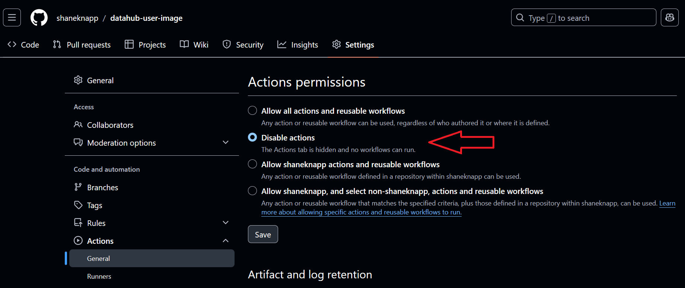
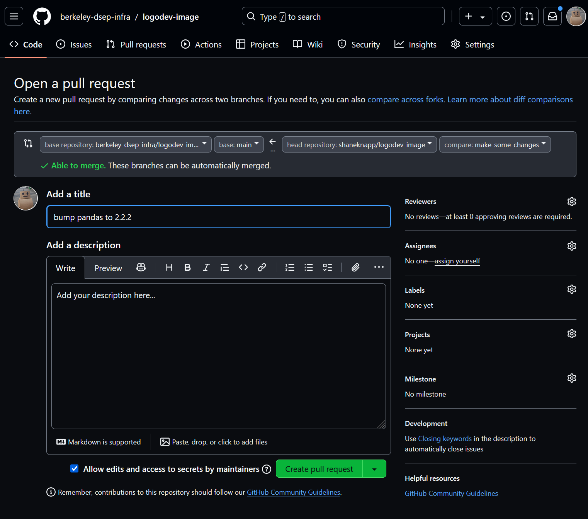

# How to contribute and make changes to your user image

## Setting up your fork and clones
First, go to your [GitHub profile settings](https://github.com/settings/keys)
and make sure you have an SSH key uploaded.

Next, go to the GitHub repo of the image that you'd like to work on and create
a fork.  To do this, click on the `fork` button and then `Create fork`.


After you create your fork of the new image repository, you should disable GitHub Actions **only for your fork**.  To do this, navigate to `Settings` --> `Actions` --> `General` and select `Disable actions`.  Then click `Save`:



Now clone the primary image repo on your local device.  You can get the URL to do
this by clicking on the green `Code` button in the primary image repo (*not* your fork)
and clicking on `SSH` and copying the text located therein:


Now `cd` in to a handy folder on your device, and clone the primary repo by
running the following command (replace `<image-name>` with the actual name
of the image):

```
git clone git@github.com:berkeley-dsep-infra/<image-name>.git
```

Now `cd` in to `<image-name>` and set up your local repo to point both at the primary
image repo (`upstream`) and your fork (`origin`).  After the initial clone,
`origin` will be pointing to the main repo and we'll need to change that.

```
cd <image-name>
git remote rename origin upstream # rename origin to upstream
git remote add origin git@github.com:<your github username>/<image-name>.git # add your fork as origin
```

To confirm these changes, run `git remote -v` and see if everything is correct:
```
$ cd <image-name>
$ git remote -v # confirm the settings
origin	git@github.com:<your github username>/<image-name>.git (fetch)
origin	git@github.com:<your github username>/<image-name>.git (push)
upstream	git@github.com:berkeley-dsep-infra/<image-name>.git (fetch)
upstream	git@github.com:berkeley-dsep-infra/<image-name>.git (push)
```

Now you can sync your local repo from `upstream`, and push those changes to your
fork (`origin`):

```
git checkout main && \
git fetch --prune --all && \
git rebase upstream/main && \
git push origin main
```

## Procedure

When developing for this deployment, always work in a fork of this repo.
You should also make sure that your repo is up-to-date with this one prior
to making changes. This is because other contributors may have pushed changes
after you last synced with this repo but before you upstreamed your changes.

```
git checkout main && \
git fetch --prune --all && \
git rebase upstream/main && \
git push origin main
```

To create a new feature branch and switch to it, run the following command:

```
git checkout -b <branch name>
```

After you make your changes, you can use the following commands to see
what's been modified and check out the diffs:  `git status` and `git diff`.

### Building the image locally

You should use [repo2docker](https://repo2docker.readthedocs.io/en/latest/) to build and use/test the image on your own device before you push and create a PR.  It's better (and typically faster) to do this first before using CI/CD.  There's no need to waste GitHub Action minutes to test build images when you can do this on your own device!

Run `repo2docker` from inside the cloned image repo.  To run on a linux/WSL2 linux shell:
```
repo2docker . # <--- the path to the repo
```

If you are using an ARM CPU (Apple M* silicon), you will need to run `jupyter-repo2docker` with the following arguments:

```
jupyter-repo2docker --user-id=1000 --user-name=jovyan \
  --Repo2Docker.platform=linux/amd64 \
  --target-repo-dir=/home/jovyan/.cache \
  -e PLAYWRIGHT_BROWSERS_PATH=/srv/conda \
  . # <--- the path to the repo
```

If you just want to see if the image builds, but not automatically launch the server, add `--no-run` to the arguments (before the final `.`).

### Pushing the modified files to your fork

When you're ready to push these changes, first you'll need to stage them for a
commit:

```
git add <file1> <file2> ...
```

Commit these changes locally:

```
git commit -m "some pithy commit description"
```

Now push to your fork:

```
git push origin <branch name>
```

### Creating a pull request

Once you've pushed to your fork, you can go to the image repo and there should
be a big green button on the top that says `Compare and pull request`.
Click on that, check out the commits and file diffs, edit the title and
description if needed and then click `Create pull request`.




If you're having issues, you can refer to the [GitHub documentation for pull
requests](https://help.github.com/articles/about-pull-requests/).
Keep the choice for `base` in the GitHub PR user interface, while the choice
for `head` is your fork.

Once this is complete and if there are no problems, a GitHub action will
automatically [build and test](https://github.com/berkeley-dsep-infra/hub-user-image-template/blob/main/.github/workflows/build-test-image.yaml)
the image.  If this fails, please check the output of the workflow in the
action, and make any changes required to get the build to pass.

### Code reviews and merging the pull request

Once the image build has completed successfully, you can request that
someone review the PR before merging, or you can merge yourself if you are
confident. This merge will trigger a [second giuthub workflow](https://github.com/berkeley-dsep-infra/hub-user-image-template/blob/main/.github/workflows/build-push-image-commit.yaml)
that builds the image again, pushes it to the appropriate location in our
Google Artifact Registry and finally creates and pushes a commit to the
[Datahub](https://github.com/berkeley-dsep-infra/datahub) repo updating the
image hash of the deployment to point at the newly built image.

### Creating a pull request in the Datahub repository

You will now need to create a pull request in the Datahub repo to merge these changes
and deploy them to `staging` for testing.

After the image is built and pushed to the Artifact registry, and the commit
that modifies that deployment's `hubploy.yaml` is pushed to the Datahub repo,
there are a couple of different ways you can create the pull request.

#### Via the workflow output

The workflow that builds and pushes has two jobs, and the second job is called
`update-deployment-image-tag`.  When completed, it will display the output from
the `git push` command. This contains a clickable link that takes you directly
to the page to create a pull requests. You can navigate to it by clicking on
`Actions` in the image repo (not your fork!), and clicking on the latest
completed job.


After you've clicked on the appropriate workflow run, select the
`udpate-deployment-image-tag` job, and expand 
`Create feature branch, add, commit and push changes` step.  You will see a
link there that will direct you to the Datahub repo and create a pull request.


#### Via the Datahub repo

You can also visit the Datahub repo and manually create the pull request there.
Go to the
[Pull Request tab](https://github.com/berkeley-dsep-infra/datahub/pulls) and
click on `New pull request`. You should see a new branch in the list that
will be from your most recent build. The branch will be named based on
the image that was updated, and will look something like this:

```
update-<hubname>-iamge-tag-<new hash of the image>
```


Click on that link, and then on `Create pull request`. 

#### Notify Datahub staff
Let the Datahub staff know that you've created this pull request and they will review and merge it
into the `staging` branch. You can notify them via a corresponding GitHub Issue, or on the UCTech
#datahubs slack channel.

Once it's been merged to `staging`, it will automatically deploy the new image to the hub's
staging environment in a few minutes and you'll be able to test it out!